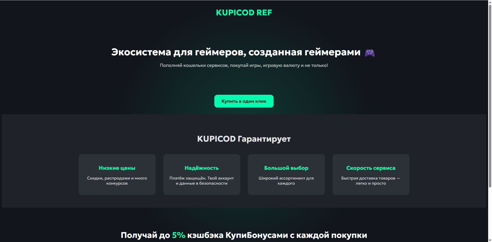

# 🎮 Landing Page for the Bonus Program

Демонстрационный **лендинг бонусной программы**.  
Проект создан для демонстрации навыков вёрстки, адаптации под маркетинговые страницы и работы с современными UI-подходами.

🔗 **Онлайн демо:** [Посмотреть на GitHub Pages](https://hoadf.github.io/Landing-page-for-the-bonus-program/)  
💾 **Исходный код:** [Репозиторий на GitHub](https://github.com/hoadf/Landing-page-for-the-bonus-program)

---

## 🖼️ Превью

---

## 💡 О проекте

Мини-лендинг, демонстрирующий оформление промо-страниц для онлайн-платформ.  
Главная цель — показать умение создавать визуально чистые, понятные и адаптивные страницы, работающие без фреймворков.

Особенности:
- Семантическая HTML-структура  
- Минималистичный дизайн  
- Адаптивная вёрстка  
- Использование SEO-мета и OG-тегов  
- Кнопки CTA и логическая иерархия блоков  

---

## 🧩 Технологии

- **HTML5** — структура и мета-данные  
- **CSS3** — оформление и адаптивность  
- **JavaScript (Vanilla)** — динамическая дата в футере  

---

## 📤 Хостинг

Сайт опубликован с помощью **GitHub Pages**.

---

📄 **Лицензия**  
Проект предназначен для демонстрационных целей (портфолио).  
Разрешено использовать как шаблон с указанием автора.  

✉️ **Автор проекта:** *HOADF*  
💬 **Направление:** создание сайтов и веб-приложений, интеграция с ChatGPT, Python-разработка, визуализация в Blender.

---

> ℹ️ Все упоминания бренда *Kupikod* используются исключительно в демонстрационных целях. Проект не связан с реальной компанией и служит примером лендинга для портфолио.
